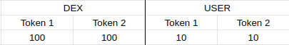
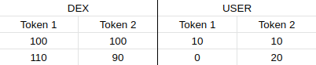
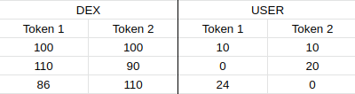
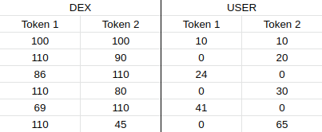
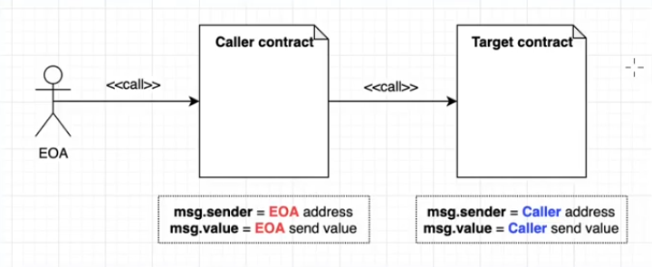
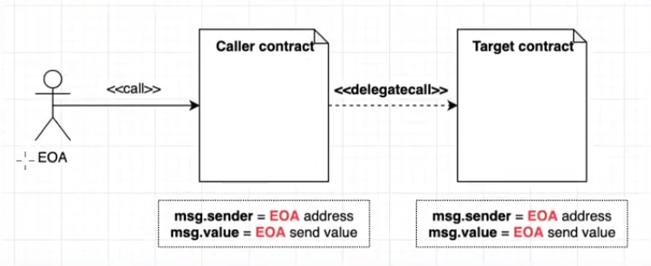
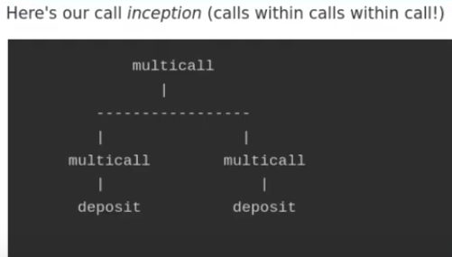

# About this repo

Suite to solve [Ethernaut](https://ethernaut.openzeppelin.com/) challenges.

<a href="http://duckduckgo.com" target="_blank">Test open in a new window in a .md file</a>

**Prior to using this Ethernaut solving suite:**

1. Create and fill a **.env** file with the data specified in **.env.example** on the root folder
2. Run `yarn` on this folder.

- If you wanna skip Etherscan verifications, don't fill out the ETHERSCAN_API_KEY variable.


## File locations

- **contracts/ folder**: Original and attacker contracts are inside the same file
- **deploy/ folder**: Deploy scripts for attacks that require deploying another contract
- **scripts/ folder**: Scripts that run the entire attack from start to finish (pwn)
- **.env**: **Env**ironment variables. Located on the root folder of the project.

For any troubles, visit the [Troubleshooting](#troubleshooting) section.

# Index

1. [Fallback](#01---fallback)
2. [Fallout](#02---fallout)
3. [CoinFlip](#01---coinflip)
4. [Telephone](#04---telephone)
5. [Token](#05---token)
6. [Delegation](#06---delegation)
7. [Force](#07---force)
8. [Vault](#08---vault)
9. [King](#09---king)
10. [Reentrance](#10---reentrance)
11. [Elevator](#11---elevator)
12. [Privacy](#12---privacy)
13. [Gatekeeper One](#13---gatekeeper-one)
14. [Gatekeeper Two](#14---gatekeeper-two)
15. [Naught Coin](#15---naught-coin)
16. [Preservation](#16---preservation)
17. [Recovery](#17---recovery)
18. [Magic Number](#18---magic-number)
19. [Alien Codex](#19---alien-codex)
20. [Denial](#20---denial)
21. [Shop](#21---shop)
22. [Dex](#22---dex)
23. [Dex Two](#23---dex-two)
24. [Puzzle Wallet](#24---puzzle-wallet)
25. [Motorbike](#25---motorbike)
26. [DoubleEntryPoint](#26---double-entry-point)
27. [Good Samaritan](#27---good-samaritan)

# 01 - Fallback

Lesson on calling the **[receive function](https://docs.soliditylang.org/en/v0.8.17/contracts.html?highlight=receive#receive-ether-function)**.

1. Change the address in **scripts/fallback.js** to your instance address
2. Run `yarn hardhat run scripts/fallback.js`

# 02 - Fallout

Lesson on... dangers of not using **constructor keyword**? Paying attention to **typos**?

3. Change the address in **scripts/fallout.js** to your instance address
4. Run `yarn hardhat run scripts/fallout.js`

# 03 - Coinflip

Lesson on **[exploiting blockhash "randomness"](https://docs.soliditylang.org/en/latest/units-and-global-variables.html#block-and-transaction-properties)**.

1. Change the address in **contracts/CoinFlip.sol** to your instance address
2. Run `yarn hardhat run scripts/coinflip.js`

Note: If one of the "guesses" fails, comment out the "deploy" section of the script and uncomment the "use existing contract" one, then populate it with your attacker contract's address. Or just go to Etherscan and call the "attack" write function every some seconds, your call.

# 04 - Telephone

Lesson on **using a contract to attack** another contract.

1. Change the address in **contracts/Telephone.sol** to your instance address
2. Run `yarn hardhat run scripts/telephone.js`

# 05 - Token

Lesson on **[underflow and overflow](https://docs.soliditylang.org/en/v0.8.17/control-structures.html?highlight=underflow#checked-or-unchecked-arithmetic)**.

1. Change the address in **scripts/token.js** to your instance address
2. Run `yarn hardhat run scripts/token.js`

# 06 - Delegation

Lesson on **[delegatecall](https://docs.soliditylang.org/en/v0.8.17/introduction-to-smart-contracts.html?highlight=delegatecall#delegatecall-and-libraries)** and calling through **[fallback function](https://docs.soliditylang.org/en/v0.8.17/contracts.html?highlight=fallback#fallback-function)**

1. Change the address in **scripts/delegation.js** to your instance address
2. Run `yarn hardhat run scripts/delegation.js`

# 07 - Force

Lesson on **[self-destruct](https://docs.soliditylang.org/en/v0.8.17/introduction-to-smart-contracts.html?highlight=self%20destruct#deactivate-and-self-destruct)**.

1. Change the address in **contracts/Force.sol** to your instance address
2. Run `yarn hardhat run scripts/force.js`

# 08 - Vault

Lesson on **[private variables](https://docs.soliditylang.org/en/v0.8.17/security-considerations.html?highlight=private#private-information-and-randomness)** and **[storage slots](https://docs.soliditylang.org/en/v0.8.17/internals/layout_in_storage.html?highlight=storage%20slots)**.

1. Change the address in **scripts/vault.js** to your instance address
2. Run `yarn hardhat run scripts/vault.js`

# 09 - King

Lesson on **payable** keyword in **constructor** and **disabling receive function**

3. Change the address in **deploy/09-deploy-king.js** to your instance address
4. Run `yarn hardhat run scripts/king.js`

# 10 - Reentrance

Lesson on **[reentrancy attacks](https://docs.soliditylang.org/en/v0.8.17/security-considerations.html#re-entrancy)**.

1. Change the address in **contracts/Reentrance.sol** to your instance address
2. Run `yarn hardhat run scripts/reentrance.js`

# 11 - Elevator

Lesson on **interfaces** (and them not having the view keyword...) and using a **boolean toggle**.

1. Change the address in **contracts/Elevator.sol** to your instance address
2. Run `yarn hardhat run scripts/elevator.js`

# 12 - Privacy

Lesson on size and ordering of **[storage slots](https://docs.soliditylang.org/en/latest/internals/layout_in_storage.html#layout-of-state-variables-in-storage)**.

1. Change the address in **scripts/privacy.js** to your instance address
2. Run `yarn hardhat run scripts/privacy.js`

# 13 - Gatekeeper One

Lesson on **typecasting**, **data types**, and **gas calculation**

1. Change the address in **contracts/GatekeeperOne.sol** to your instance address
2. Run `yarn hardhat run scripts/gatekeeperOne.js`

## About

First condition is just calling from another contract. Done.

## Getting the right gas

Copied solution from [this guy](https://www.youtube.com/watch?v=AUQxXJiqLF4) that doesn't explain very well how it's done. My interpretation is that it just multiplies 3 times 8191 to get enough gas in any network conditions, then adds up from 150 up to 270 to cover the whole range the transaction could cost.

## About getting the right bytes8 key

### Condition 1:

- Hexadecimal uses 4 bits per digit (0-9+a-f)
- And it uses two digits per byte
- If 1 byte consists in 2 digits, bytes8 has 16 digits

0xXXXXXXXXXXXXXXXX

- 1 byte = 8 bits
- 8 bytes = 64 bits

**bytes8** has the same amount of digits as **uint64**

First requirement converts one argument from uint64 to uint32 -> uint32(uin64(\_gateKey)),

That means it takes this part of the password:
0x XXXXXXXX **"XXXXXXXX"**

and it has to equal the same argument from uint64 to uint16 on the other side, -> uint16(uint64(\_gateKey))

0x XXXXXXXX XXXX **"XXXX"**

When comparing to a uint32, the uint16 will fill the bytes it doesn't have with zeros, that's why:

0x XXXXXXXX **0000** XXXX

We already have 4 digits of the password!

Password: 0xXXXXXXXX**0000**XXXX

### Condition 2:

Last 4 bytes (8 digits, or uint32) must not be equal to uint64 of key
uint32(uint64(\_gateKey)) != uint64(\_gateKey)

0x **"00000000"** 0000XXXX != 0x **XXXXXXXX** XXXXXXXX

This means that first 4 bytes (8 digits) must have at least one different digit than 0
0x **"XXXXXXXX"** 0000XXXX

Password: 0x**XXXXXXXX0000**XXXX

### Condition 3:

First requirement converts one argument from uint64 to uint32 | uint32(uin64(\_gateKey)),
and must equal first two bytes (4 digits, or uint16) of tx.origin (our address!) || uint16(tx.origin)

0x XXXXXXXX 0000 "XXXX"

That last "XXXX" MUST be the last 4 digits of our wallet address.

Password: 0x**XXXXXXXX0000XXXX**

Attacker contract is using the **Masking bits off** function with the & operator on your wallet address.

- **1001**0101 <- This
- **1111**0000 <- AND this
- **1001**0000 <- Equals this (only both 1 result in 1)

- X value with 0 equals 0
- X value with 1 equals X.

# 14 - Gatekeeper Two

Lesson on **contract size before initializing** and the **xor operator**.

1. Change the address in **deploy/14-deploy-gatekeepertwo.js** to your instance address
2. Run `yarn hardhat run scripts/gatekeeperTwo.js`

## About

### Condition 2:

To call from a contract of size 0, we must call the enter function from the constructor, because the contract's size will be 0 until it is initialized.

Here's the reference inside the code

assembly {
x := **extcodesize**(caller())
}

### Condition 3:

^ stands for xor bitwise operator, this is an exclusive or operator.

This means that if: a ^ b == c, then a ^ c == b

- & : and (x, y) bitwise **and** of x and y; where 1010 & 1111 == 1010 (true false true false)
- | : or (x, y) bitwise **or** of x and y; where 1010 | 1111 == 1111 (true true true true)
- ^ : xor (x, y) bitwise **xor** of x and y; where 1010 ^ 1010 == 0101 (false true false true)
- ~ : not (x) bitwise **not** of x; where ~1010 == 0101 (false true false true)

# 15 - Naught Coin

Lesson on **ERC20** standard, and approving to **transferFrom** any address (including our own).

1. Change the address in **scripts/naughtCoin.js** to your instance address
2. Run `yarn hardhat run scripts/naughtCoin.js`

# 16 - Preservation

Lesson combining knowledge of **Privacy** and **Delegation** challenges.

1. Change the address in **scripts/preservation.js** to your instance address
2. Run `yarn hardhat run scripts/preservation.js`

# 17 - Recovery

Lesson on **contract creation addresses**.

1. Change the address in **scripts/recovery.js** to your instance address
2. Run `yarn hardhat run scripts/recovery.js`

## Getting contract creation address

To figure out a contract address, it takes the rightmost 20 bytes (160 bits) of the keccak hash of the RLP encoding of the structure containing only the sender of the contract creation transaction and the nonce of that transaction.[(page 10 of Ethereum Yelowpaper)](https://ethereum.github.io/yellowpaper/paper.pdf)

`address = rightmost_20_bytes(keccak(RLP(sender address, nonce)))`

RLP = Recursive Length Prefix

In the attack script, we're using [ethers.utils.SolidityKeccak256](https://docs.ethers.io/v5/api/utils/hashing/#utils-solidityKeccak256)

`ethers.utils.solidityKeccak256( types , values ) ⇒ string< DataHexString< 32 > > source`
Returns the KECCAK256 of the non-standard encoded values packed according to their respective type in types.

As a reference: **abi.encodePacked** in Solidity gives the same output as **ethers.utils.solidityPack**
Here we encode and hash directly into keccak256 with a single command with **solidityKeccak256**.

The RLP encoding of a 20-byte address is: 0xd6, 0x94 .
And for all integers less than 0x7f, its encoding is just its own byte value.
So the RLP of 1 is 0x01.

That's how we end with this line:

```shell
const simpleTokenAdd = await ethers.utils.solidityKeccak256(
    ["bytes1", "bytes1", "address", "bytes1"],
    ["0xd6", "0x94", recoveryInstanceAddress, "0x01"]
  )
```

And then just take the last 40 digits (20 bytes) -because each byte is 2 digits-, and append them to "0x" to form the contract's address:

```shell
const simpleTokenAddress =
"0x" + simpleTokenAdd.substring(simpleTokenAdd.length - 40, simpleTokenAdd.length)
```

# 18 - Magic Number

Lesson on Opcode, Bytecode, Contract Creation vs. Runtime.

1. Change the address in **scripts/magicNumber.js** to your instance address
2. Run `yarn hardhat run scripts/magicNumber.js`

## About

[Creation vs. Runtime](https://blog.openzeppelin.com/deconstructing-a-solidity-contract-part-ii-creation-vs-runtime-6b9d60ecb44c/)

Goal is to run two sets of OPCODES. One for **creation** (initialization) and another for **runtime** (10 OPCODES or less).
Once initialized, runtime is stored for future computations.

Solidity Code (high level) > Opcodes > Byte code (EVM language)

### Runtime code

To RETURN 42, we need:

1. First we need to PUSH the value (v)
2. Then we need to store it in memory with MSTORE, which needs position (p) first and then size (s)
3. Then we RETURN the value (v)

[Hex to Decimal converter](https://www.rapidtables.com/convert/number/hex-to-decimal.html)

Using the converter, we can see that 42 value in Hex is **0x2a**

[EVM Opcodes](https://github.com/crytic/evm-opcodes)

PUSH is 0x60
MSTORE is 0x52
RETURN is 0xf3

Bytecode - Description

1. **602a** - PUSH the value (v) to MSTORE. In this case, we push 42 (0x2a).
2. **6050** - PUSH the position (p) (0x50) to MSTORE
3. **52** - Store value (v=0x2a) at position (p=0x50) in memory.
4. **6020** - PUSH the size (s) of v to the stack. In this case, we push 32 (0x20) for 32 bytes.
5. **6050** - PUSH the position (p) of the size (s) (slot in which value was stored). In this case, position was 0x50.
6. **f3** - RETURN value, v=0x24 (42) of size s=0x20 (32 bytes)

Concatenated, it reads: `602a60505260206050f3`

This is **10 bytes**, as it has 20 digits when concatenated.

[Solidity Bytecode and Opcode Basics](https://medium.com/@blockchain101/solidity-bytecode-and-opcode-basics-672e9b1a88c2)

"In the EVM, there are 3 places to store data. Firstly, in the stack. We’ve just used the “PUSH” opcode to store data there as per the example above. Secondly in the memory (RAM) where we use the “MSTORE” opcode and lastly, in the disk storage where we use “SSTORE” to store the data. The gas required to store data to storage is the most expensive and storing data to stack is the cheapest."

### Creation (initialization) code

The CODECOPY opcode can be used to copy the runtime opcodes. It takes three arguments: the **destination** position of copied code in memory, **current position** of runtime opcode in the bytecode and **size** of the code in bytes.

Value 10 (size of our code in bytes) in hex is **0x0a**

We don't know the position of runtime opcode in the final bytecode (since initialization opcode comes before runtime opcode), so
we omit by setting position as unknown with --.

After CODECOPY, we need to specify the values for RETURN.

1. **600a** - PUSH size of runtime opcode to stack. Size (s) param for COPYCODE.
2. **60--** - PUSH -- (unknown) to the stack. Position (p) param for COPYCODE.
3. **6000** - PUSH 0x00 (chosen destination in memory) in stack. Destination (d) param for COPYCODE.
4. **39** - CODECOPY of size (s) at position (p) to destination (d) in memory.
5. **600a** - PUSH 0x0a (size of our runtime opcode) in stack. Size (s) param for RETURN.
6. **6000** - PUSH 0x00 (location of value in memory) in stack. Position (p) param for RETURN.
7. **f3** - RETURN value (v) of size (s) at position (p)

So the initialization opcode is `600460--600039600a6000f3` which is 12 bytes in total.

Which means that runtime opcodes start at index 12 or position **0x0c**

Therefore, initialization opcode must be `6004600c600039600a6000f3`

### Final opcode

Concatenate initialization opcode with runtime opcode:

```shell
600a600c600039600a6000f3 + 602a60505260206050f3
600a600c600039600a6000f3602a60505260206050f3
```

And now we can create the contract by sending a transaction to the zero address (0x0) with some data as it will be interpreted as Contract Creation by the EVM.

On scripts/magicnumber.js, I appendedd **0x** at the beginning of the final opcode to make it readable as hex to be able to send the transaction.

More in-depth guides: [Watch how to solve it](https://www.youtube.com/watch?v=FsPWuKK8mWI&list=PLiAoBT74VLnmRIPZGg4F36fH3BjQ5fLnz&index=19) - [Read how to solve it](https://medium.com/coinmonks/ethernaut-lvl-19-magicnumber-walkthrough-how-to-deploy-contracts-using-raw-assembly-opcodes-c50edb0f71a2)

# 19 - Alien Codex

Lesson on **Check-Effect-Interact** and **layout of dynamically-sized arrays in storage**

1. Change the address in **scripts/alienCodex.js** to your instance address
2. Run `yarn hardhat run scripts/alienCodex.js`

## About

First step is to make contact. Then we retract, so we substract 1 from position 0. Then we gotta figure out where is the owner. Then we gotta figure out the format to enter our address.

### Check-Effect-Interact

Retract function doesn't respect the [Check-Effect-Interact pattern](https://docs.soliditylang.org/en/v0.8.17/security-considerations.html#use-the-checks-effects-interactions-pattern), it does the effect right away. If something doesn't respect the CEI pattern, there's a chance **there's a security vulnerability there.**

**codex.length--** is gonna remove the last element from the array.

We're doing this Effect without doing first a Check. This allows the opportunity to do an **underflow** on the array. If we substract 1 from the position 0, we're going to go to the last element of the array, and we're gonna start from there, which will allow to put anything we want wherever we want in the storage of the contract.

### Layout of State Variables in Storage

State variables of contracts are stored in storage in a compact way such that **multiple values sometimes use the same storage slot**. **Except for dynamically-sized arrays** and mappings (see below), data is stored contiguously item after item starting with the first state variable, which is stored in slot 0. [Read more in SolidityLang.org](https://docs.soliditylang.org/en/latest/internals/layout_in_storage.html)

Dynamically sized arrays use keccak-256 to find the starting position (always full stack slot - 32 bytes).

**Mapping**

- p = position (storing the array length)
- k = value (value corresponding to the mapping)

- keccak256(k.p)

To find this information, we hash them together by concatenating then hashing them

1. **p = web3.utils.keccak256(web3.abi.encodeParameters(["uint256"], [1]))**

Position: We're gonna hash with keccak256 the parameters (["uint256"], [1])
This is gonna be slot 1 inside AlienCodex.
Remember slot 0 has the owner address and contact boolean set to true.

2. i = BigInt(2 \*\* 256) - BigInt(p)

We substact to go to the slot 0, not inside the contract storage, but **inside the array storage**, because that's where the owner is.
Converting hashed value to BigInt, we're able to substact back to Slot 0 of the codex.

3. Content = "0x" + "0".repeat(24) + playeraddress.slice(2)

playeraddress.slice(2) <- This takes out the 0x at the beginning of playeraddress

Padding our address with 0's to meet the expected 32 bytes length.

Exploiting a flaw in the ABI specs. Doesn't validate that the length of the array matches the length of the payload. (e.g 0'd out.)

4. contract.revise(i, content)

Place our **content** into the owner array **index** location

[Watch how to solve it](https://www.youtube.com/watch?v=oGx-EvSsQbE)

# 20 - Denial

Lesson on [different ways of sending value](https://solidity-by-example.org/sending-ether/) and **assert method on ^0.6.0** (doesn't revert the transaction)

1. Change the address in **scripts/denial.js** to your instance address
2. Run `yarn hardhat run scripts/denial.js`

## About sending value

**send and transfer**:

- Require an address to be marked as **payable** to send them ETH.
- They cost 2300 gas to prevent reentrancy vulnerability.

**call**

- Doesn't require an address to be marked as payable to send them ETH.
- Can be manually specified how much gas to use.

```shell
function depositUsingTransfer(address payable _to) public payable {
    _to.transfer(msg.value); // 2300 gas, throws error
}

function depositUsingSend(address payable _to) public payable {
    bool sent = _to.send(msg.value); // 2300 gas, returns bool that can be used to throw error
    require(sent, "Error! Ether not sent!");
}
```

**Call** returns bool and the return (if any) of calling the specified function.
Gas can also be specified: `_to.call{gas: 20000, value: ...}`

```shell
function depositUsingCall(address _to) public payable {

    (bool sent, /* bytes memory data */) = _to.call{value: msg.value}("");
    require(sent, "Error! Ether not sent!");
}
```

## About assert

There are 3 ways of throwing an error: **assert, revert and require**

For this version of the solidity compiler (^0.6.0), **revert and require** undo any state changes that have occurred until that error was reached. **assert did not** refund or return any of the gas that was sent to it.

require(condition, "Error explanation")
revert("an error has occurred") <- Usually nested inside some logic
assert(condition)

# 21 - Shop

Lesson on **interfaces** and using **ternary operators** to bypass repeated check with a **boolean toggle** in between

1. Change the address in **scripts/shop.js** to your instance address
2. Run `yarn hardhat run scripts/shop.js`

# 22 - Dex

Lesson on **DEX mechanisms** and Solidity's **inhability to comprehend floating point numbers**

1. Change the address in **scripts/shop.js** to your instance address
2. Run `yarn hardhat run scripts/shop.js`

## About

In Solidity, 3 / 2 = 1, because it can't comprehend floating point numbers such as 1.5.

We start like this:



Then we swap all of our Token 1 for Token 2



At this point the exchange rate changed. Now **20 token2** would be **20 \* 110 / 90 = 24,444**

Since **result is an integer**, we get 24 token2. Swap again to get another price readjustment.



Each swap gets us more of token1 or token2 than we had before, because of the **inaccuracy of price calculation** in the get_swap_price function. Keep swapping:



Now we got enough tokens to drain the 110 token1! 65 tokens would get us 158!
**65 \* 110 / 45 = 158**

But as there aren't enough tokens, we need to calculate that number down.
**110 \* 45 / 110 = 45**

We just need to swap 45 tokens in that last transaction :)

# 23 - Dex Two

Lesson on **ERC20 standard**, **DEX oracle manipulation**, and using **transferFrom** to bypass restrictions.

1. Change the address in **scripts/dexTwo.js** to your instance address
2. Run `yarn hardhat run scripts/dexTwo.js`

## About

[Read how to solve it](https://daltyboy11.github.io/every-ethernaut-challenge-explained/#dex-two)

# 24 - Puzzle Wallet

Lesson on **delegatecall** and **proxy contracts**.

## Reccomended reads:

- [EIP-1967: Proxy Storage Slots](https://eips.ethereum.org/EIPS/eip-1967)
- [Proxies (OpenZeppelin docs)](https://docs.openzeppelin.com/contracts/4.x/api/proxy)

## About

When an EOA (Externally Owned Account) does a call to a contract that does a **regular call** to another contract, the contract is taken as sender and owner of value for the second contract.



But with **delegatecall**, EOA is taken as sender and owner of value for the second contract. (i.e: Logic contract (2nd) for a Proxy contract (1st))



For the attack, we're using Multicall to Multicall twice the deposit function.



[Watch how to solve it](https://www.youtube.com/watch?v=toVc-iX-XAA) - [Shorter video](https://www.youtube.com/watch?v=3JcS-04cAj0)

# 25 - Motorbike

Lesson on **proxy contracts**, **Initializable contracts**, **getStorageAt**, **delegatecall** and **selfdestruct**.

1. Change the address in **scripts/motorbike.js** to your instance address
2. Run `yarn hardhat run scripts/motorbike.js`

## Useful reads:

- [EVM Dialect](https://docs.soliditylang.org/en/v0.8.17/yul.html?highlight=evm%20dialect#evm-dialect)
- [UUPS Proxies](https://forum.openzeppelin.com/t/uups-proxies-tutorial-solidity-javascript/7786)

## About

1. Gain access to Engine (Address is inside the IMPLEMENTATION_SLOT location)
2. "Initialize" to make ourselves the "upgrader"
3. Deploy a attacker contract with self destruct
4. Call "upgradeToAndCall" to attacker contract
5. Self destruct attacker contract

[Watch how to solve it](https://www.youtube.com/watch?v=D7IfmkINYJ0) - [Another video](https://www.youtube.com/watch?v=WdiCzB3zjy0) - [Read how to solve it](https://dev.to/nvn/ethernaut-hacks-level-25-motorbike-397g)

# 26 - Double Entry Point

**You can read about it below**

[Watch how to solve it](https://www.youtube.com/watch?v=aGnC_917YOY) - [Read how to solve it](https://dev.to/nvn/ethernaut-hacks-level-26-double-entry-point-1774) - [Another read](https://daltyboy11.github.io/every-ethernaut-challenge-explained/#doubleentrypoint) - [A GitHub repo!](https://github.com/maAPPsDEV/double-entry-point-attack)

# 27 - Good Samaritan

Read how to do it:

- [Link 1](https://dev.to/erhant/ethernaut-27-good-samaritan-1cp6)
- [Link 2](https://hackernoon.com/good-samaritan-the-new-ethernaut-ctf-challenge)
- [Link 3](https://blog.dixitaditya.com/ethernaut-level-27-good-samaritan)
- [Link 4](https://coinsbench.com/27-good-samaritan-ethernaut-6de5de92d3e3)
- [Link 5](https://blog.blockmagnates.com/ethernaut-lvl-27-good-samaritan-walkthrough-custom-errors-in-solidity-17c7e20fb58a)

# Troubleshooting

## General errors

- Check level indications to see if you **set the parameters right** for your instance.
- **Did you save** after changing address to your instance?
- Delete **"artifacts"** and **"cache"** folder and **run the command again**.

## "nonce too low" / Pending transaction stuck:

If you get this error when submitting level instance, it's because you used some nonces to send the transactions that attack the level. In your MetaMask, go to **Settings > Advanced > Reset Account**

## Don't have Goerli ETH

Get some here: [Chainlink Faucet](https://faucets.chain.link/) - [Alchemy Faucet](https://goerlifaucet.com/)

## Don't have yarn

- Just enter `npm install --global yarn` on your console.
- Don't have NPM either? [Go get the LTS champ!](https://nodejs.org/en/download/)
- Don't know how to use it? Search how to :)

## Don't know how to fill .env file

- GOERLI_RPC URL: [Alchemy (step 1 and 2)](https://www.alchemy.com/overviews/private-rpc-endpoint)
- PRIVATE_KEY: [Metamask](https://metamask.zendesk.com/hc/en-us/articles/360015289632-How-to-export-an-account-s-private-key)
- (optional) ETHERSCAN_API_KEY: [Etherscan](https://info.etherscan.com/api-keys/)

## (optional) Use different network than Goerli:

1. Add your network (i.e: **mumbai**) as **DefaultNetwork** on hardhat.config.js
2. **Add it's parameters** in network section same as goerli is added.

### (optional) Want to use Mumbai

- MUMBAI_RPC_URL: [Alchemy (step 1 and 2)](https://www.alchemy.com/overviews/private-rpc-endpoint)
- PRIVATE_KEY is the same
- (optional) POLYGONSCAN_API_KEY: [Register and get one](https://polygonscan.com/apis)
